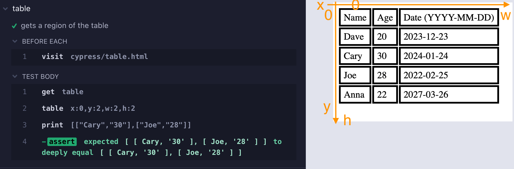

# cypress-map [](https://github.com/bahmutov/cypress-map/actions/workflows/ci.yml) 

> Extra Cypress query commands for v12+

- 📺 Watch the videos:
  - [Cypress v12 Querying Commands Introduction](https://youtu.be/4HpEECek2OE)
  - [Confirm Table Column](https://youtu.be/UOLQlNmuhY0)
  - [Use cypress-map Queries To Validate A Row In A Table](https://youtu.be/eVe4ySgW0qw)
  - [How To Check Visibility Of Many Elements](https://youtu.be/puCZGCeUb5k)
  - [Pick A Random Menu Link](https://youtu.be/xvvL3GRjXCY)
  - [Confirm The Same Text In A Couple Of Elements](https://youtu.be/xvImOlCSul4)
  - [Map Input Elements Values](https://youtu.be/OmVzv6pJN6I)
  - [Iterate Over DOM Elements Using cy.each, jQuery each and map, and cypress-map Plugin Commands](https://youtu.be/tMeKIIfEhyo)
  - [Confirm Sorted Attributes](https://youtu.be/sVb5MU2AkqE)
- 📝 Read the blog posts
  - [Cypress V12 Is A Big Deal](https://glebbahmutov.com/blog/cypress-v12/)
  - [Crawl Weather Using Cypress](https://glebbahmutov.com/blog/crawl-weather/)
  - [Pass Values Between Cypress Tests](https://glebbahmutov.com/blog/pass-values-between-tests/)
  - [Do Not Use SHA To Compare HTML During E2E Tests](https://glebbahmutov.com/blog/do-not-use-sha/)
- 🎓 Covered in my course [Cypress Plugins](https://cypress.tips/courses/cypress-plugins)
  - [Lesson l1: Confirm the attribute of the last item](https://cypress.tips/courses/cypress-plugins/lessons/l1)
  - [Lesson l2: Confirm the extracted list of texts](https://cypress.tips/courses/cypress-plugins/lessons/l2)
  - [Lesson l3: Confirm the last two items in the extracted lis](https://cypress.tips/courses/cypress-plugins/lessons/l3)
  - [Lesson l4: Confirm the list of attributes](https://cypress.tips/courses/cypress-plugins/lessons/l4)
  - [Lesson l5: Confirm the sum of attributes](https://cypress.tips/courses/cypress-plugins/lessons/l5)
  - [Lesson l6: Compare the sum of attributes to the total](https://cypress.tips/courses/cypress-plugins/lessons/l6)
  - [Lesson l7: Debug chained queries using tap](https://cypress.tips/courses/cypress-plugins/lessons/l7)
  - [Lesson l8: Get the raw DOM element at index k](https://cypress.tips/courses/cypress-plugins/lessons/l8)
  - [Lesson l9: Confirm the number of elements with the given attribute](https://cypress.tips/courses/cypress-plugins/lessons/l9)
  - [Lesson l10: Check the parsed attribute value](https://cypress.tips/courses/cypress-plugins/lessons/l10)
  - [Lesson l11: Extract and convert prices](https://cypress.tips/courses/cypress-plugins/lessons/l11)
  - [Lesson l12: Find the element with the smallest attribute value](https://cypress.tips/courses/cypress-plugins/lessons/l12)
  - [Lesson l13: Check each item's text](https://cypress.tips/courses/cypress-plugins/lessons/l13)
  - [Lesson l14: Flexible logging using cy.print command](https://cypress.tips/courses/cypress-plugins/lessons/l14)
  - [Lesson l15: Confirm HTML table values](https://cypress.tips/courses/cypress-plugins/lessons/l15)
  - [Lesson l17: Control the network and confirm the table](https://cypress.tips/courses/cypress-plugins/lessons/l17)
- 🎓 Covered in my course [Cypress Network Testing Exercises](https://cypress.tips/courses/network-testing)
  - [Bonus 92: Map each item from the list using Cy commands](https://cypress.tips/courses/network-testing/lessons/bonus92)
  - [Bonus 100: Check all network responses at once with auto retries](https://cypress.tips/courses/network-testing/lessons/bonus100)
- 🎓 Covered in my course [Testing The Swag Store](https://cypress.tips/courses/swag-store)
  - [Lesson 23: Simplify getting attribute from a list of elements](https://cypress.tips/courses/swag-store/lessons/lesson23)
  - [Bonus 36: Manipulate data- attributes using cypress-map methods](https://cypress.tips/courses/swag-store/lessons/bonus36)
  - [Bonus 41: Pick and confirm a random product](https://cypress.tips/courses/swag-store/lessons/bonus41)
  - [Bonus 42: Add 3 random items to the cart](https://cypress.tips/courses/swag-store/lessons/bonus42)

## Install

Add this package as a dev dependency

```
$ npm i -D cypress-map
# or using Yarn
$ yarn add -D cypress-map
```

Include this package in your spec or support file to use all custom query commands

```js
import 'cypress-map'
```

Alternative: import only the query commands you need:

```js
import 'cypress-map/commands/map'
import 'cypress-map/commands/tap'
// and so on, see the /commands folder
```

## API

### apply

```js
const double = (n) => n * 2
cy.wrap(100).apply(double).should('equal', 200)
```

It works like `cy.then` but `cy.apply(fn)` is a query command. Function `fn` should be synchronous, pure function that only uses the subject argument and returns new value The function callback `fn` cannot use any Cypress commands `cy`.

### partial

Sometimes you have the callback to apply, and you know the first argument(s), and just need to put the subject at the last position. This is where you can partially apply the known arguments to the given callback.

```js
// the Cypress._.add takes to arguments (a, b)
// we know the first argument a = 5
// so we partially apply it and wait for the subject = b argument
cy.wrap(100).partial(Cypress._.add, 5).should('equal', 105)
// same as
cy.wrap(100)
  .apply((subject) => Cypress._.add(5, subject))
  .should('equal', 105)
```

### map

Transforms every object in the given collection by running it through the given callback function. Can also map each object to its property. An object could be an array or a jQuery object.

```js
// map elements by invoking a function
cy.wrap(['10', '20', '30']).map(Number) // [10, 20, 30]
// map elements by a property
cy.get('.matching')
  .map('innerText')
  .should('deep.equal', ['first', 'third', 'fourth'])
```

You can even map properties of an object by listing callbacks. For example, let's convert the `age` property from a string to a number

```js
cy.wrap({
  age: '42',
  lucky: true,
})
  .map({
    age: Number,
  })
  .should('deep.equal', {
    age: 42,
    lucky: true,
  })
```

You can extract nested paths by using "." in your property path

```js
cy.wrap(people)
  .map('name.first')
  .should('deep.equal', ['Joe', 'Anna'])
// equivalent to
cy.wrap(people)
  .map('name')
  .map('first')
  .should('deep.equal', ['Joe', 'Anna'])
```

### mapInvoke

```js
cy.get('#items li')
  .find('.price')
  .map('innerText')
  .mapInvoke('replace', '$', '')
  .mapInvoke('trim')
```

### reduce

```js
cy.get('#items li')
  .find('.price')
  .map('innerText')
  .mapInvoke('replace', '$', '')
  .map(parseFloat)
  .reduce((max, n) => (n > max ? n : max))
// yields the highest price
```

You can provide the initial accumulator value

```js
cy.wrap([1, 2, 3])
  .reduce((sum, n) => sum + n, 10)
  .should('equal', 16)
```

See [reduce.cy.js](./cypress/e2e/reduce.cy.js)

### tap

```js
cy.get('#items li')
  .find('.price')
  .map('innerText')
  .tap() // console.log by default
  .mapInvoke('replace', '$', '')
  .mapInvoke('trim')
  // console.info with extra label
  .tap(console.info, 'trimmed strings')
```

**Notice:** if the label is provided, the callback function is called with label and the subject.

### print

A better `cy.log`: yields the value, intelligently stringifies values using `%` and [string-format](https://github.com/davidchambers/string-format) notation.

```js
cy.wrap(42)
  .print() // "42"
  // and yields the value
  .should('equal', 42)
// pass formatting string
cy.wrap(42).print('the answer is %d') // "the answer is 42"
cy.wrap({ name: 'Joe' }).print('person %o') // 'person {"name":"Joe"}'
// use {0} with dot notation, supported deep properties
// https://github.com/davidchambers/string-format
cy.wrap({ name: 'Joe' }).print('person name {0.name}') // "person name Joe"
// print the length of an array
cy.wrap(arr).print('array length {0.length}') // "array length ..."
// pass your own function to return formatted string
cy.wrap(arr).print((a) => `array with ${a.length} items`)
// if you return a non-string, it will attempt to JSON.stringify it
cy.wrap(arr).print((list) => list[2]) // JSON.stringify(arr[2])
```

See [print.cy.js](./cypress/e2e/print.cy.js) for more examples

### findOne

Finds a single item in the subject. Assumes subject is an array or a jQuery object. Uses Lodash `_.find` method.

```js
// using predicate function
const isThree = n => n === 3
cy.wrap([...]).findOne(isThree).should('equal', 3)
// using partial known properties of an object
cy.wrap([...]).findOne({ name: 'Anna' }).should('have.property', 'name', 'Anna')
```

See [find-one.cy.js](./cypress/e2e/find-one.cy.js)

### primo

```js
cy.get('.matching')
  .map('innerText')
  .primo()
  .invoke('toUpperCase')
  .should('equal', 'FIRST')
```

See [primo.cy.js](./cypress/e2e/primo.cy.js)

### prop

Works like `cy.its` for objects, but gets the property for jQuery objects, which `cy.its` does not

```js
cy.get('#items li.matching')
  .last()
  .prop('ariaLabel')
  .should('equal', 'four')
```

See [prop.cy.js](./cypress/e2e/prop.cy.js)

### update

Changes a single property inside the subject by running it through the given callback function. Useful to do type conversions, for example, let's convert the "age" property to a Number

```js
cy.wrap({ age: '20' })
  .update('age', Number)
  .should('deep.equal', { age: 20 })
```

### at

Returns a DOM element from jQuery object at position `k`. Returns an item from array at position `k`. For negative index, counts the items from the end.

```js
cy.get('#items li').at(-1).its('innerText').should('equal', 'fifth')
```

See [at.cy.js](./cypress/e2e/at.cy.js)

### sample

Returns a randomly picked item or element from the current subject

```js
cy.get('#items li').sample().should('have.text', 'four')
```

If you pass a positive number, then it picks multiple elements or items

```js
// yields jQuery object with 3 random items
cy.get('#items li').sample(3).should('have.length', 3)
```

See [sample.cy.js](./cypress/e2e/sample.cy.js)

### asEnv

Saves current subject in `Cypress.env` object. Note: Cypress.env object is reset before the spec run, but the changed values are passed from test to test. Thus you can easily pass a value from the first test to the second.

```js
it('saves value in this test', () => {
  cy.wrap('hello, world').asEnv('greeting')
})

it('saved value is available in this test', () => {
  expect(Cypress.env('greeting'), 'greeting').to.equal('hello, world')
})
```

Do you really want to make the tests dependent on each other?

### table

📝 to learn more about `cy.table` command, read the blog post [Test HTML Tables Using cy.table Query Command](https://glebbahmutov.com/blog/cy-table/).

Extracts all cells from the current subject table. Yields a 2D array of strings.

```js
cy.get('table').table()
```

You can slice the table to yield just a region `.table(x, y, w, h)`



For example, you can get 2 by 2 subregion

```js
cy.get('table')
  .table(0, 2, 2, 2)
  .should('deep.equal', [
    ['Cary', '30'],
    ['Joe', '28'],
  ])
```

See the spec [table.cy.js](./cypress/e2e/table.cy.js) for more examples.

**Tip:** you can combine `cy.table` with `cy.map`, `cy.mapInvoke` to get the parts of the table. For example, the same 2x2 part of the table could be extracted with:

```js
cy.get('table')
  .table()
  .invoke('slice', 2, 4)
  .mapInvoke('slice', 0, 2)
  .should('deep.equal', [
    ['Cary', '30'],
    ['Joe', '28'],
  ])
```

**Tip 2:** to get just the headings row, combine `.table` and `.its` queries

```js
cy.get('table')
  .table(0, 0, 3, 1)
  .its(0)
  .should('deep.equal', ['Name', 'Age', 'Date (YYYY-MM-DD)'])
```

To get the last row, you could do:

```js
cy.get('table').table().invoke('slice', -1).its(0)
```

To get the first column joined into a single array (instead of array of 1x1 arrays)

```js
cy.get('table')
  .table(0, 1, 1) // skip the heading "Name" cell
  // combine 1x1 arrays into one array
  .invoke('flatMap', Cypress._.identity)
  .should('deep.equal', ['Dave', 'Cary', 'Joe', 'Anna'])
```

### toPlainObject

A query to convert special DOM objects into plain objects. For example, to convert `DOMStringMap` instance into a plain object compatible with `deep.equal` assertion we can do

```js
cy.get('article')
  .should('have.prop', 'dataset')
  .toPlainObject()
  .should('deep.equal', {
    columns: '3',
    indexNumber: '12314',
    parent: 'cars',
  })
```

### invokeOnce

In Cypress v12 `cy.invoke` became a query, which made working with asynchronous methods really unwieldy. The `cy.invokeOnce` is a return the old way of calling the method and yielding the resolved value.

```js
cy.wrap(app)
  // app.fetchName is an asynchronous method
  // that returns a Promise
  .invokeOnce('fetchName')
  .should('equal', 'My App')
```

See the spec [invoke-once.cy.js](./cypress/e2e/invoke-once.cy.js) for more examples.

## cy.invoke vs cy.map vs cy.mapInvoke

Here are a few examples to clarify the different between the `cy.invoke`, `cy.map`, and `cy.mapInvoke` query commands, see [diff.cy.js](./cypress/e2e/diff.cy.js)

```js
const list = ['apples', 'plums', 'bananas']

// cy.invoke
cy.wrap(list)
  // calls ".sort()" on the list
  .invoke('sort')
  .should('deep.equal', ['apples', 'bananas', 'plums'])

// cy.mapInvoke
cy.wrap(list)
  // calls ".toUpperCase()" on every string in the list
  .mapInvoke('toUpperCase')
  .should('deep.equal', ['APPLES', 'PLUMS', 'BANANAS'])

// cy.map
const reverse = (s) => s.split('').reverse().join('')
cy.wrap(list)
  // reverses each string in the list
  .map(reverse)
  .should('deep.equal', ['selppa', 'smulp', 'sananab'])
  // grabs the "length" property from each string
  .map('length')
  .should('deep.equal', [6, 5, 7])
```

## Misc

### mapChain

I have added another useful command (not a query!) to this package. It allows you to process items in the array subject one by one via synchronous, asynchronous, or `cy` command functions. This is because the common solution to fetch items using `cy.each`, for example does not work:

```js
// fetch the users from a list of ids
// 🚨 DOES NOT WORK
cy.get(ids).each(id => cy.request('/users/' + id)).then(users => ...)
// Nope, the yielded "users" result is ... still the "ids" subject
// ✅ CORRECT SOLUTION
cy.get(ids).mapChain(id => cy.request('/users/' + id)).then(users => ...)
```

## Types

This package includes TypeScript command definitions for its custom commands in the file [commands/index.d.ts](./commands/index.d.ts). To use it from your JavaScript specs:

```js
/// <reference types="cypress-map" />
```

If you are using TypeScript, include this module in your types list

```json
{
  "compilerOptions": {
    "types": ["cypress", "cypress-map"]
  }
}
```

## See also

- [cypress-should-really](https://github.com/bahmutov/cypress-should-really) has similar functional helpers for constructing the `should(callback)` function on the fly.

## Small print

Author: Gleb Bahmutov &lt;gleb.bahmutov@gmail.com&gt; &copy; 2022

- [@bahmutov](https://twitter.com/bahmutov)
- [glebbahmutov.com](https://glebbahmutov.com)
- [blog](https://glebbahmutov.com/blog)
- [videos](https://www.youtube.com/glebbahmutov)
- [presentations](https://slides.com/bahmutov)
- [cypress.tips](https://cypress.tips)
- [Cypress Tips & Tricks Newsletter](https://cypresstips.substack.com/)
- [my Cypress courses](https://cypress.tips/courses)

License: MIT - do anything with the code, but don't blame me if it does not work.

Support: if you find any problems with this module, email / tweet /
[open issue](https://github.com/bahmutov/cypress-map/issues) on Github
